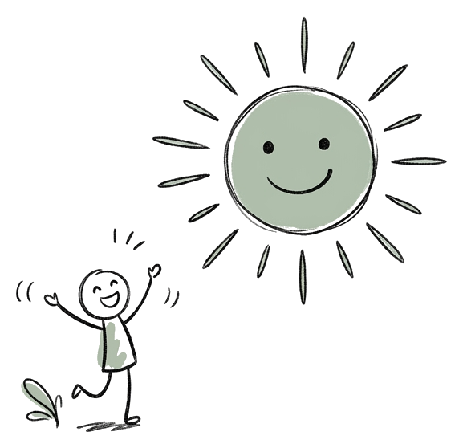
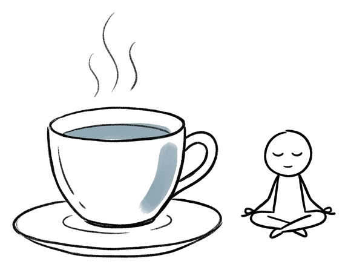

# 心叶 App · CSS 组件库 v2.2

> 直接复制即用。所有颜色/阴影/圆角/动效都使用 CSS 自定义属性,改一处全局生效。

---

## 一、CSS 变量(放在 :root)

```css
:root {
  /* === 基础色 === */
  --bg:           #FFFFFF;
  --bg-soft:      #FAFAF8;
  --paper:        #F6F5F3;
  --ink:          #3E3A37;
  --ink-soft:     #9B9792;
  --line:         #E8E6E2;
  --line-dashed:  #C5D0BC;

  /* === 品牌色 === */
  --brand:        #7E9280;
  --brand-dark:   #5C7060;
  --brand-soft:   #C5D0BC;

  /* === 手绘线 === */
  --ink-line:     #2B2826;
  --paper-note:   #EDE6D6;

  /* === 6 心情色(基础) === */
  --mood-happy:    #9BAE9A;
  --mood-calm:     #8FA8B5;
  --mood-tired:    #A69CAE;
  --mood-sad:      #7E8EA5;
  --mood-anxious:  #C2A08A;
  --mood-angry:    #BF8F84;

  /* === 6 心情色(12% 透明,用于背景) === */
  --mood-happy-12:    rgba(155,174,154,0.12);
  --mood-calm-12:     rgba(143,168,181,0.12);
  --mood-tired-12:    rgba(166,156,174,0.12);
  --mood-sad-12:      rgba(126,142,165,0.12);
  --mood-anxious-12:  rgba(194,160,138,0.12);
  --mood-angry-12:    rgba(191,143,132,0.12);

  /* === 6 心情色(30% 透明,用于阴影) === */
  --mood-happy-30:    rgba(155,174,154,0.3);
  --mood-calm-30:     rgba(143,168,181,0.3);
  --mood-tired-30:    rgba(166,156,174,0.3);
  --mood-sad-30:      rgba(126,142,165,0.3);
  --mood-anxious-30:  rgba(194,160,138,0.3);
  --mood-angry-30:    rgba(191,143,132,0.3);

  /* === 6 心情色(深色,用于选中文字) === */
  --mood-happy-dark:    #5C7060;
  --mood-calm-dark:     #5A7180;
  --mood-tired-dark:    #6B5C75;
  --mood-sad-dark:      #4A5A6E;
  --mood-anxious-dark:  #8A6B4F;
  --mood-angry-dark:    #8A5A50;

  /* === 字体 === */
  --font-handwrite: '演示悠然小楷', 'Caveat', 'Noto Serif SC', serif;
  --font-sans:      'PingFang SC', 'Inter', 'Noto Sans SC', system-ui, sans-serif;

  /* === 动效曲线 === */
  --ease-standard:  cubic-bezier(0.4, 0, 0.2, 1);
  --ease-spring:    cubic-bezier(0.34, 1.56, 0.64, 1);
  --ease-decel:     cubic-bezier(0.16, 1, 0.3, 1);
}
```

---

## 二、心情选择器(核心组件 v2.2 无框版)

> **关键原则:** 插画是裸的、文字是直排的、无任何框圈住。选中态是手绘圈 + ✓ + 字变粗。

### 2.1 HTML 结构

```html
<div class="mood-grid">
  <div class="mood-item" data-mood="happy">
    
    <span class="mood-label">开心</span>
  </div>

  <div class="mood-item selected" data-mood="calm" style="--mood-color: var(--mood-calm);">
    <svg class="mood-circle-svg" viewBox="0 0 100 100" aria-hidden="true">
      <path class="mood-circle-path" d="M 50,8 Q 88,12 92,52 Q 90,92 48,90 Q 8,86 10,48 Q 14,10 50,8 Z"
            stroke="currentColor" stroke-width="2.5" fill="none" stroke-linecap="round"/>
    </svg>
    
    <span class="mood-check" aria-hidden="true">✓</span>
    <span class="mood-label">平静</span>
  </div>

  <!-- 剩余 4 个 mood-item ... -->
</div>
```

### 2.2 CSS

```css
.mood-grid {
  display: grid;
  grid-template-columns: repeat(2, 1fr);
  gap: 28px 20px;     /* 行 28px,列 20px,像书页 */
  padding: 8px 4px;
}

.mood-item {
  position: relative;
  display: flex;
  flex-direction: column;
  align-items: center;
  gap: 8px;
  cursor: pointer;
  /* 关键:无背景、无边框 */
  background: transparent;
  border: none;
  padding: 8px 0;
  transition: transform 200ms var(--ease-standard);
}

.mood-item:hover {
  transform: translateY(-3px);
}

.mood-art {
  width: 96px;
  height: 96px;
  object-fit: contain;
  /* 关键:图片本身透明,无需任何包装 */
  filter: drop-shadow(0 1px 0 rgba(0,0,0,0.04));
  transition: transform 280ms var(--ease-spring);
}

.mood-item:hover .mood-art {
  transform: translateY(-3px) scale(1.05);
}

.mood-item.selected .mood-art {
  transform: scale(1.1);
}

.mood-label {
  font-family: var(--font-handwrite);
  font-size: 18px;
  color: var(--ink);
  letter-spacing: 2px;
  transition: all 200ms;
}

.mood-item.selected .mood-label {
  color: var(--mood-color-dark);
  font-weight: 600;
}

/* 选中态:SVG 手绘圈(关键差异化) */
.mood-circle-svg {
  position: absolute;
  top: 0;
  left: 50%;
  transform: translateX(-50%);
  width: 110px;
  height: 110px;
  pointer-events: none;
  opacity: 0;
  color: var(--mood-color);
  transition: opacity 300ms;
}

.mood-item.selected .mood-circle-svg {
  opacity: 1;
}

.mood-circle-path {
  stroke-dasharray: 330;
  stroke-dashoffset: 330;
}

.mood-item.selected .mood-circle-path {
  animation: drawCircle 700ms var(--ease-standard) forwards;
}

@keyframes drawCircle {
  to { stroke-dashoffset: 0; }
}

/* 选中态:小对勾 */
.mood-check {
  position: absolute;
  top: 6px;
  right: 8px;
  font-family: var(--font-handwrite);
  font-size: 22px;
  color: var(--mood-color);
  opacity: 0;
  transform: scale(0) rotate(-30deg);
  transition: all 300ms var(--ease-spring);
}

.mood-item.selected .mood-check {
  opacity: 1;
  transform: scale(1) rotate(-5deg);
}
```

### 2.3 圆圈 SVG 路径(多种手绘风格备选)

```html
<!-- A. 不规则椭圆(推荐,有手绘感) -->
<path d="M 50,8 Q 88,12 92,52 Q 90,92 48,90 Q 8,86 10,48 Q 14,10 50,8 Z" />

<!-- B. 略方的圆(更稳重) -->
<path d="M 50,10 Q 90,15 88,55 Q 85,88 45,90 Q 12,85 12,45 Q 15,12 50,10 Z" />

<!-- C. 飘逸的圆(更活泼) -->
<path d="M 50,6 C 88,8 95,48 90,55 C 92,92 48,95 45,88 C 8,90 5,50 10,45 C 8,8 48,5 50,6 Z" />
```

---

## 三、卡片

```css
.card {
  background: var(--bg);
  border: 1px solid var(--line);
  border-radius: 16px;
  padding: 20px;
  /* 不使用阴影,用边框代替 */
}

.card-warm {
  background: var(--paper);
  border: none;
  border-radius: 16px;
  padding: 20px;
}

/* 撕角效果(便签风格,可选) */
.card-torn {
  position: relative;
}
.card-torn::before {
  content: '';
  position: absolute;
  top: 0; right: 0;
  width: 24px; height: 24px;
  background: linear-gradient(225deg, transparent 50%, var(--paper) 50%);
}
```

---

## 四、按钮

### 4.1 主按钮(品牌绿)

```css
.btn-primary {
  height: 48px;
  padding: 0 28px;
  background: var(--brand);
  color: #FFFFFF;
  border: none;
  border-radius: 24px;       /* 全圆角胶囊 */
  font-family: var(--font-sans);
  font-size: 15px;
  font-weight: 500;
  letter-spacing: 0.5px;
  box-shadow: 0 2px 8px rgba(126,146,128,0.2);
  transition: all 200ms var(--ease-standard);
  cursor: pointer;
}

.btn-primary:hover {
  background: var(--brand-dark);
  transform: translateY(-1px);
}

.btn-primary:active {
  transform: scale(0.98);
}

.btn-primary:disabled {
  background: #C8C5C0;
  box-shadow: none;
  cursor: not-allowed;
}
```

### 4.2 次按钮(线框)

```css
.btn-outline {
  height: 48px;
  padding: 0 24px;
  background: transparent;
  color: var(--ink);
  border: 1.5px solid var(--ink);
  border-radius: 24px;
  font-family: var(--font-sans);
  font-size: 15px;
  font-weight: 500;
  cursor: pointer;
  transition: all 200ms;
}

.btn-outline:hover {
  background: var(--ink);
  color: #FFFFFF;
}
```

### 4.3 FAB 悬浮按钮

```css
.fab {
  width: 60px;
  height: 60px;
  background: var(--ink-line);     /* 墨黑,非纯黑 */
  color: #FFFFFF;
  border: none;
  border-radius: 50%;
  display: flex;
  align-items: center;
  justify-content: center;
  cursor: pointer;
  box-shadow:
    0 4px 12px rgba(43,40,38,0.15),
    0 0 0 4px rgba(255,255,255,0.6);
  transition: all 200ms var(--ease-spring);
}

.fab:hover {
  transform: scale(1.05);
  box-shadow:
    0 6px 16px rgba(43,40,38,0.2),
    0 0 0 4px rgba(255,255,255,0.8);
}

.fab:active {
  transform: scale(0.95);
}

.fab-icon {
  font-size: 26px;
  /* 用 ✎(铅笔)而非 +,暗示"书写" */
}
```

---

## 五、输入框(写记录页)

```css
.write-input {
  width: 100%;
  min-height: 240px;
  background: transparent;
  border: 1.5px dashed var(--line-dashed);    /* 虚线浅绿框,像手账本 */
  border-radius: 16px;
  padding: 24px;
  font-family: var(--font-handwrite);
  font-size: 17px;
  line-height: 1.8;
  color: var(--ink);
  resize: none;
  outline: none;
  transition: all 200ms;
}

.write-input::placeholder {
  color: var(--ink-soft);
  font-style: italic;
}

.write-input:focus {
  border-color: var(--brand);
  border-style: solid;
  background: rgba(197,208,188,0.08);
}
```

**占位符文案(手写温度):**
- "今天想说点什么吗?"
- "没事,只是写下就好。"
- "深呼吸,然后开始。"

---

## 六、Tab 栏(底部)

```css
.tab-bar {
  height: 64px;
  background: var(--bg);
  border-top: 1px solid var(--line);
  display: flex;
  justify-content: space-around;
  align-items: center;
  position: sticky;
  bottom: 0;
}

.tab-item {
  display: flex;
  flex-direction: column;
  align-items: center;
  gap: 2px;
  font-family: var(--font-sans);
  font-size: 11px;
  color: var(--ink-soft);
  cursor: pointer;
  transition: color 200ms;
  position: relative;
}

.tab-item.active {
  color: var(--brand);
  font-weight: 500;
}

/* 选中态:上方加一个手绘小圆点(像盖章) */
.tab-item.active::before {
  content: '';
  width: 6px;
  height: 6px;
  background: var(--brand);
  border-radius: 50%;
  margin-bottom: 2px;
  box-shadow: 0.5px -0.5px 0 var(--brand);
}
```

---

## 七、时间线节点(首页)

```css
.timeline {
  position: relative;
  padding-left: 32px;
}

.timeline::before {
  content: '';
  position: absolute;
  left: 6px; top: 0; bottom: 0;
  width: 1px;
  background: var(--line);
}

.timeline-date {
  position: absolute;
  left: 0; top: 8px;
  width: 13px;
  height: 13px;
  border: 1.5px solid var(--ink-soft);
  background: var(--bg);
  border-radius: 50%;
}

/* 今日节点(实心绿色) */
.timeline.today .timeline-date {
  background: var(--brand);
  border-color: var(--brand);
  width: 15px;
  height: 15px;
  left: -1px;
}

.timeline-date-label {
  font-family: var(--font-handwrite);
  font-size: 14px;
  color: var(--ink-soft);
  margin-bottom: 12px;
  padding-left: 24px;
}
```

---

## 八、顶部一周横条(7 天圆点)

```css
.week-strip {
  display: flex;
  gap: 12px;
  padding: 16px 20px;
  overflow-x: auto;
  scrollbar-width: none;
}
.week-strip::-webkit-scrollbar { display: none; }

.day-dot {
  width: 36px;
  height: 36px;
  border-radius: 50%;
  background: var(--paper);
  display: flex;
  align-items: center;
  justify-content: center;
  font-family: var(--font-handwrite);
  font-size: 13px;
  color: var(--ink-soft);
  flex-shrink: 0;
  position: relative;
}

.day-dot.has-record::after {
  content: '';
  position: absolute;
  bottom: 2px;
  width: 6px;
  height: 6px;
  border-radius: 50%;
  background: var(--day-mood-color, var(--brand));
}

.day-dot.today {
  background: var(--brand);
  color: #FFFFFF;
  font-weight: 500;
}
```

---

## 九、标签 Chip

```css
.tag {
  display: inline-flex;
  align-items: center;
  padding: 6px 14px;
  background: transparent;
  border: 1.5px solid var(--line);
  border-radius: 14px;
  font-family: var(--font-sans);
  font-size: 12px;
  color: var(--ink-soft);
  cursor: pointer;
  transition: all 200ms;
}

.tag:hover {
  border-color: var(--brand);
  color: var(--brand);
}

.tag.selected {
  background: var(--brand);
  border-color: var(--brand);
  color: #FFFFFF;
}
```

---

## 十、统计页条形图

```css
.bar-row {
  display: grid;
  grid-template-columns: 64px 1fr 60px;
  align-items: center;
  gap: 18px;
}

.bar-art {
  width: 64px;
  height: 64px;
  object-fit: contain;
}

.bar-name {
  font-family: var(--font-handwrite);
  font-size: 15px;
  color: var(--ink);
  margin-bottom: 6px;
  font-weight: 500;
}

.bar-bg {
  height: 5px;
  background: var(--paper);
  border-radius: 3px;
  overflow: hidden;
}

.bar-fill {
  height: 100%;
  background: var(--mood-color);
  border-radius: 3px;
  transition: width 600ms var(--ease-standard);
}

.bar-count {
  font-family: var(--font-handwrite);
  font-size: 22px;
  color: var(--mood-color);
  text-align: right;
  font-weight: 600;
}
```

---

## 十一、深色模式(可选)

```css
[data-theme="dark"] {
  --bg:           #1C1B19;
  --bg-soft:      #252320;
  --paper:        #2A2826;
  --ink:          #E8E6E2;
  --ink-soft:     #9B9792;
  --line:         #3A3835;
  --line-dashed:  #5C7060;
  --ink-line:     #E8E6E2;
}
```

---

## 十二、禁止清单 ⚠️

- ❌ 给 `.mood-art` 加 `background` 或 `border-radius: 50%`
- ❌ 给 `.mood-item` 加 `border` 或 `background`
- ❌ 用 emoji 作图标
- ❌ 用纯黑 #000000(用 #2B2826)
- ❌ 渐变色按钮
- ❌ 阴影超过 `0 4px 12px`(心叶风格克制)
- ❌ 圆角超过 32px(显得过度圆润)
- ❌ 字号超过 32px(不要在 UI 内堆巨型字)
- ❌ 任何超过 400ms 的过渡(手绘圈 700ms 例外)
